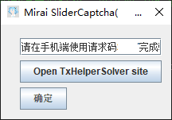
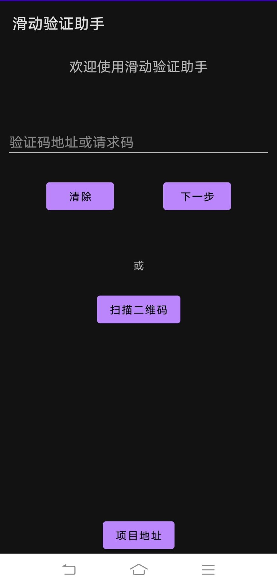

# Mirai API HTTP 安装

!!! info "注意"

    本教程需要：

    - 基础文件操作能力
    - 基础终端使用能力 (按 Tab 与 Enter)
    - 搜索引擎使用能力
    - 一个脑子

    什么? 你没有? 请退出吧, 本教程不适合你。

# 1. 安装 mirai-console-loader

!!! tip "提示"

    若你已经安装了 `mirai-console`, 请直接移步 [2. 安装与配置 mirai-api-http](#2-mirai-api-http)

从 [`mcl-installer release`](https://github.com/iTXTech/mcl-installer/releases/latest) 下载适合 **你电脑架构** 的版本.

!!! note "如果你实在不知道用哪个版本, 可以按照你用的操作系统试过去."

!!! warning "在下载完成后直接移动到目标安装位置, 并创建沿途的文件夹."

完成后, 打开你的终端, 输入:

```bash
./mcl-installer # 使用 Tab 键补全路径, 之后回车.
```

你应该会看到 **类似** 的东西:

```
iTXTech MCL Installer 1.0.3 [OS: windows]
Licensed under GNU AGPLv3.
https://github.com/iTXTech/mcl-installer

iTXTech MCL and Java will be downloaded to "F:\PythonProjects\mah-pure-inst"

Checking existing Java installation.
...
Would you like to install Java? (Y/N, default: Y)
```

如果你不会英文, 可以一路回车了.

之后你大概能看到这样的结构:

```
MCL
│
├───java
│       ...
│
├───scripts
│       ...
│   LICENSE
│   mcl
│   mcl.cmd
│   mcl.jar
│   README.md
```

之后, 运行

```bash
./mcl
```

你会看到类似的输出:

```
[INFO] Verifying "net.mamoe:mirai-console" v
[ERROR] "net.mamoe:mirai-console" is corrupted.
Downloading ......
xxxx-xx-xx xx:xx:xx I/main: Starting mirai-console...
......
xxxx-xx-xx xx:xx:xx I/main: mirai-console started successfully.

>
```

此时输入 `/autoLogin add <你的QQ号> <你的QQ密码>` 并回车.

应该会显示 `已成功添加 '<你的QQ号>'.`

!!! error "在向他人报告问题时 _永远_ 不要泄露你的敏感信息."

之后先输入 `stop` 并回车, 退出 `mirai-console`.

# 2. 安装与配置 mirai-api-http

从 [`mirai-api-http release`](https://github.com/project-mirai/mirai-api-http/releases/latest) 页下载最新的 `.jar` 文件.

文件名像这样: `mirai-api-http-v2.X.X.mirai.jar`

放到 `mirai-console` 安装目录下的 `plugins` 文件夹内, **不要做任何其他操作**.

# 3. 登录 QQ

执行 `./mcl` 启动 `mirai-console` .

如果直接显示 `Event: BotOnlineEvent(bot=Bot(<你的QQ号>))` 那么恭喜你, 你已经 [完成](#4) 了.

但是... 如果像下面那样弹出一个弹窗, 那你还要往下看.

!!! note "Linux NoGUI 用户请在桌面环境下先配置好, 之后复制 `bots` 文件夹."


点击 `Open with TxCaptchaHelper`, 会弹出一个新窗口.



在手机上下载 [`TxCaptchaHelper`](https://maupdate.rainchan.win/txcaptcha.apk) 并安装.

打开后会有如下界面:

<figure markdown>
  {width="200"}
</figure>

此时输入上方的 **4 位数** 请求码, 点击 `下一步` , 可以看到:

<figure markdown>
  {width="200"}
</figure>

完成滑块验证, 之后你就可以在电脑窗口中点击 `确定` 了.

<figure markdown>
  之后还会有一个设备锁, 如图:
  {align="right", width="500"}
</figure>

复制里面的 `url` 至 浏览器, 按照提示完成即可.

# 4. 完成

在 `config/net.mamoe.mirai-api-http` 下, 你会找到 `setting.yml` 文件.

改成如下内容 (注意依照注释更改):

```yaml
# file: "MCL/config/net.mamoe.mirai-api-http/setting.yml"
adapters:
  - http
  - ws
debug: false
enableVerify: true
verifyKey: ServiceVerifyKey # 你可以自己设定, 这里作为示范
singleMode: false
cacheSize: 4096 # 可选, 缓存大小, 默认4096. 缓存过小会导致引用回复与撤回消息失败
adapterSettings:
  ## 详情看 http adapter 使用说明 配置
  http:
    host: localhost
    port: 8080 # 端口
    cors: [*]

  ## 详情看 websocket adapter 使用说明 配置
  ws:
    host: localhost
    port: 8080 # 端口
    reservedSyncId: -1 # 确保为 -1
```

至此, 你已经完成了 `mirai-api-http` 的安装与配置. 享受使用 `Graia Framework` 开发吧!
